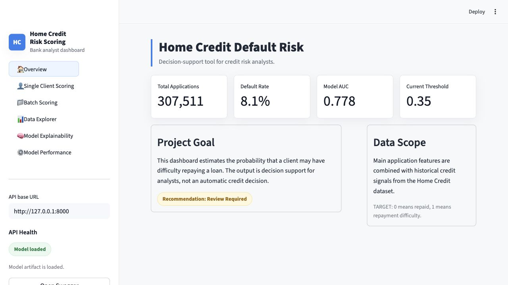
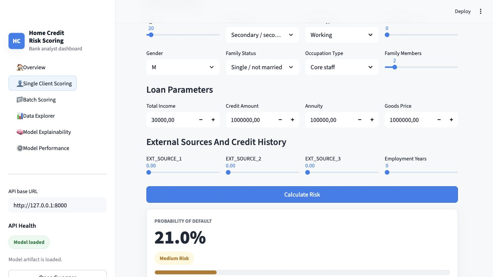

# Отчёт CP3: Home Credit Default Risk

**Студенты:** Карагюлян Армен Андраникович и Лепехов Александр Александрович
**Группа:** БИВ 232

## 1. Введение и постановка задачи

Цель проекта - построить ML-сервис, который оценивает вероятность дефолта клиента по кредитной заявке Home Credit.
Целевая переменная `TARGET`: `1` означает сложности с выплатой кредита, `0` - отсутствие дефолта.

Это задача бинарной классификации с сильным дисбалансом классов. Среди размеченных строк обучающего набора:

- `282686` клиентов без дефолта;
- `24825` клиентов с дефолтом;
- доля дефолтов - около `8.1%`.

Основная метрика - ROC-AUC. Она выбрана по трём причинам:

- модель нужна как risk-ranking tool, поэтому важно качество ранжирования заявок по вероятности дефолта;
- порог принятия решения может меняться в зависимости от риск-политики;
- ROC-AUC использовалась в оригинальной задаче Home Credit Default Risk.

Дополнительно считаются Average Precision, F1, precision, recall и accuracy. При выборе финальной модели приоритет
отдаётся ROC-AUC, затем Average Precision.

## 2. Поиск и описание данных

Источник данных - Kaggle: [Home Credit Default Risk Feature Tools](https://www.kaggle.com/datasets/willkoehrsen/home-credit-default-risk-feature-tools?select=correlations.csv).
Датасет выбран, потому что это реальная tabular ML-задача кредитного скоринга: много признаков, пропуски, дисбаланс
классов и признаки, построенные из нескольких таблиц истории клиента.

В исходном Kaggle-наборе есть несколько Featuretools-матриц и вспомогательные файлы:

| Файл | Назначение |
|---|---|
| `feature_matrix.csv` | основная Featuretools-матрица |
| `feature_matrix_advanced.csv` | расширенная матрица |
| `feature_matrix_article.csv` | матрица из статьи/примера |
| `feature_matrix_spec.csv` | компактная матрица для основного пайплайна |
| `feature_importances.csv`, `fi_fma.csv`, `spec_feature_importances_ohe.csv` | важности признаков |
| `correlations.csv`, `correlations_spec.csv` | корреляционные матрицы для анализа |

Для обучения используется `data/feature_matrix_spec.csv`: `356255` строк и `885` столбцов. Из них `48744` строк имеют
`TARGET = -999`; это Kaggle test set без разметки, поэтому он не используется в supervised-обучении.

## 3. Обработка и подготовка данных

Очистка и подготовка данных реализованы в `src/preprocessing.py`, data quality анализ - в `src/data_quality.py`.
Отдельный отчёт по качеству данных сохранён в `report/data_quality_report.md`.

Фактическое состояние основного датасета:

- всего строк: `356255`;
- всего колонок: `885`;
- размеченных строк для обучения: `307511`;
- Kaggle test rows без разметки (`TARGET = -999`): `48744`;
- дубликатов по `SK_ID_CURR`: `0`;
- колонок с пропусками: `823`;
- колонок с >= 70% пропусков: `302`;
- колонок с >= 90% пропусков: `6`;
- выбранных top-N признаков для пайплайна: `120`.

Что сделано в пайплайне:

- строки с `TARGET = -999` и `NaN` удаляются из обучающего набора;
- `TARGET` приводится к бинарному `int`;
- дубликаты удаляются по `SK_ID_CURR`;
- служебные колонки вроде `Unnamed: 0` исключаются;
- чтение данных ограничено top-N признаками по `spec_feature_importances_ohe.csv`;
- пропуски обрабатываются внутри sklearn pipeline: медиана для числовых признаков, `missing` для категориальных;
- категориальные признаки кодируются через `OneHotEncoder` для линейных моделей и `OrdinalEncoder` для деревьев;
- выбросы в числовых признаках клипуются по 1% и 99% квантилям, причём границы считаются только на train split.

Manual feature engineering:

- `NEW_CREDIT_TO_INCOME_RATIO = AMT_CREDIT / AMT_INCOME_TOTAL`;
- `NEW_ANNUITY_TO_INCOME_RATIO = AMT_ANNUITY / AMT_INCOME_TOTAL`;
- `NEW_CREDIT_TERM = AMT_ANNUITY / AMT_CREDIT`;
- `NEW_GOODS_TO_CREDIT_RATIO = AMT_GOODS_PRICE / AMT_CREDIT`;
- `NEW_EMPLOYED_TO_BIRTH_RATIO = DAYS_EMPLOYED / DAYS_BIRTH`;
- `NEW_EXT_SOURCE_MEAN` и `NEW_EXT_SOURCE_STD` по `EXT_SOURCE_1/2/3`.

Split: используется стратифицированное разбиение `70% / 15% / 15%` на train/validation/test. Data leakage предотвращается
тем, что imputer, encoder, scaler и clipping выбросов обучаются только на train-части внутри sklearn Pipeline.

Визуализации сохраняются в `report/images/`:

- `target_distribution.png` - дисбаланс классов;
- `missingness_top20.png` - признаки с максимальной долей пропусков;
- `feature_importances_top20.png` - top feature importances из Kaggle-файла;
- `target_correlations_top20.png` - сильнейшие числовые корреляции с `TARGET`;
- `pca_projection.png` - PCA-проекция выбранных числовых признаков.

## 4. Baseline-модель

Baseline - `LogisticRegression` без manual feature engineering. Для неё используется стандартная предобработка:
median imputation, `StandardScaler` для числовых признаков и `OneHotEncoder` для категориальных.

Финальный запуск сделан на `50000` строках и `120` top признаках:

| Модель | Val ROC-AUC | Test ROC-AUC | Test AP | Test F1 | Test Precision | Test Recall |
|---|---:|---:|---:|---:|---:|---:|
| `baseline_logistic_regression` | 0.747 | 0.768 | 0.256 | 0.269 | 0.167 | 0.689 |

Baseline оказался сильным, что типично для Home Credit: линейная модель с хорошей предобработкой уже хорошо ранжирует
часть кредитного риска.

## 5. Эксперименты

Эксперименты реализованы в `src/modeling.py`. Основной запуск:

```bash
python -m src.modeling --sample-size 50000 --top-n-features 120
```

Каждый эксперимент описан в формате "гипотеза -> как проверялось -> результат":

| Эксперимент | Гипотеза | Как проверялось | Test ROC-AUC | Test AP | Test F1 |
|---|---|---|---:|---:|---:|
| `hist_gradient_boosting` | Boosting должен лучше ловить нелинейные зависимости в tabular risk data | Ordinal encoding + manual feature engineering | **0.778** | 0.269 | 0.041 |
| `soft_voting_ensemble` | Усреднение разных моделей стабилизирует вероятности | Ensemble из линейной модели, bagging и boosting | 0.771 | **0.270** | 0.276 |
| `logistic_regression_fe` | Финансовые ratios улучшают линейную модель | One-hot + manual feature engineering | 0.769 | 0.260 | 0.274 |
| `baseline_logistic_regression` | Простая линейная модель задаёт нижнюю границу качества | One-hot без manual feature engineering | 0.768 | 0.256 | 0.269 |
| `random_forest` | Bagging по деревьям поймает взаимодействия признаков | Ordinal encoding + manual feature engineering | 0.763 | 0.252 | **0.321** |
| `extra_trees` | Более случайные деревья снизят variance | Ordinal encoding + manual feature engineering | 0.761 | 0.257 | 0.291 |
| `svd_logistic_regression` | Уменьшение размерности снизит шум sparse-признаков | One-hot + TruncatedSVD | 0.755 | 0.247 | 0.259 |

Уменьшение размерности проверено двумя способами:

- `svd_logistic_regression` использует `TruncatedSVD(n_components=30)` после one-hot encoding;
- `pca_projection.png` визуализирует PCA на числовых признаках для EDA.

## 6. Финальная модель и интерпретируемость

Финальная модель - `hist_gradient_boosting`, потому что она дала лучший `test_roc_auc = 0.7783`.
Артефакт модели сохранён в `models/best_model.joblib`, metadata запуска - в `models/run_metadata.json`.

Финальные метрики:

| Метрика | Значение |
|---|---:|
| Test ROC-AUC | 0.7783 |
| Test Average Precision | 0.2685 |
| Test F1 | 0.0411 |
| Test Precision | 0.4643 |
| Test Recall | 0.0215 |
| Test Accuracy | 0.9191 |

Низкий recall при стандартном пороге `0.5` ожидаем из-за сильного дисбаланса классов. В интерфейсе поэтому отдельно
показан threshold review и риск-уровни по вероятности дефолта: low, medium, high.

Интерпретируемость в проекте сделана на двух уровнях:

- global level: top feature importance из `spec_feature_importances_ohe.csv` и график `feature_importances_top20.png`;
- local level: Streamlit показывает понятные risk drivers для конкретной заявки, например низкие `EXT_SOURCE_*`,
  высокий `credit / income ratio`, высокий `annuity / income ratio` и короткую историю занятости.

## 7. Деплой

Для CP3 сделан deploy-слой из двух частей:

- FastAPI - обязательный HTTP API для отправки запросов к модели;
- Streamlit - пользовательский fintech scoring dashboard для демонстрации one-client и batch scoring сценариев.

Реализованные FastAPI endpoints:

| Endpoint | Что делает |
|---|---|
| `GET /health` | Проверяет, запущен ли сервис и доступен ли файл модели |
| `GET /model-info` | Возвращает metadata модели и ожидаемые признаки |
| `POST /predict` | Принимает признаки одного клиента и возвращает вероятность дефолта |
| `POST /predict-batch` | Делает скоринг списка клиентов |

Локальный запуск API и UI:

```bash
python3.10 -m venv .venv
.venv/bin/python -m pip install -r requirements.txt
.venv/bin/python -m uvicorn src.api.app:app --host 127.0.0.1 --port 8000
API_BASE_URL=http://127.0.0.1:8000 .venv/bin/python -m streamlit run src/ui/streamlit_app.py
```

Запуск через Docker Compose:

```bash
docker compose up --build
```

После запуска:

- FastAPI health check: `http://127.0.0.1:8000/health`;
- Swagger UI: `http://127.0.0.1:8000/docs`;
- Streamlit dashboard: `http://127.0.0.1:8501`.

Если `models/best_model.joblib` отсутствует, API и UI не падают: `/health` показывает missing-model состояние, а
`/predict` возвращает HTTP `503` с командой обучения:

```bash
python3 -m src.modeling --sample-size 50000 --top-n-features 120
```

Интерфейс сделан как скоринговый кабинет банка:

- `Overview` - KPI проекта и напоминание, что результат является decision-support;
- `Single Client Scoring` - форма одной заявки, вероятность дефолта, risk level, recommendation и risk drivers;
- `Batch Scoring` - загрузка CSV, preview, batch scoring и download CSV;
- `Data Explorer` - EDA-графики и таблица пропусков;
- `Model Explainability` - top feature importance и понятные факторы риска;
- `Model Performance` - ROC-AUC, precision, recall, F1, таблица экспериментов и threshold review.

Скриншоты:





Ссылка на видео работы: **нужен фактический URL демо-видео перед сдачей**.

## 8. Заключение и выводы

В проекте реализован полный ML-пайплайн для Home Credit Default Risk: обработка данных, feature engineering,
baseline, несколько моделей, ансамбль, эксперимент с уменьшением размерности, сохранение финальной модели и deploy.

Лучший результат по основной метрике показал `hist_gradient_boosting`: `test_roc_auc = 0.7783`. Для CP3 добавлены
FastAPI и Streamlit dashboard. Пользователь может посчитать риск одной заявки, загрузить CSV для batch scoring,
посмотреть факторы риска, EDA-графики и метрики модели.

Удалённый сервер для сдачи не обязателен: по критериям достаточно локального деплоя, если в отчёте есть скриншоты и
ссылка на видео работы приложения.
